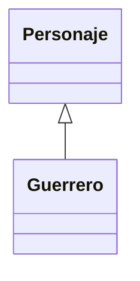
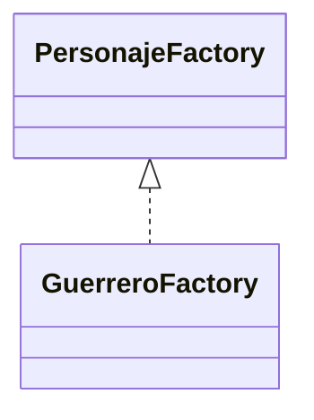
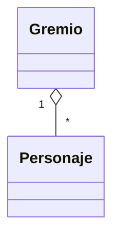
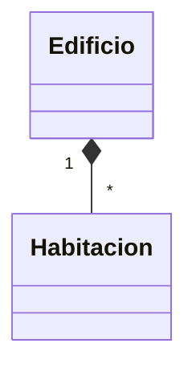
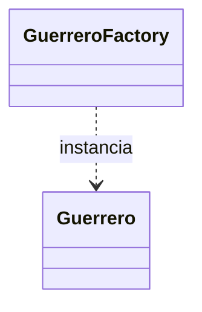
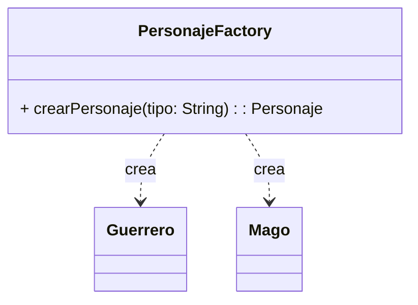
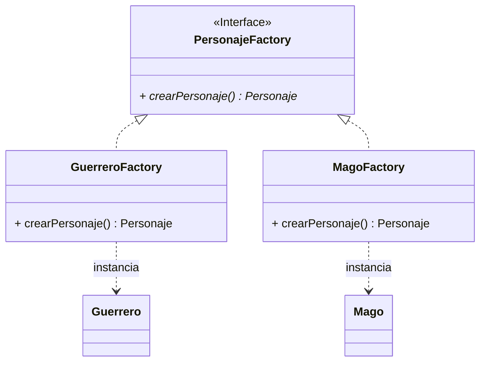

# Guía de Modelado UML y Patrones de Diseño Factory

Esta guía reúne los principios fundamentales para analizar enunciados, determinar relaciones de clases en UML con sus respectivas notaciones gráficas y comprender las diferencias entre **Simple Factory** y **Factory Method (GoF)**.

---

## 1. El Algoritmo de Análisis: 4 Preguntas Clave

Para construir un diagrama de clases sin adivinar, se debe analizar el problema siguiendo este orden estricto:

| Paso | Pregunta a realizar | Concepto OO | Resultado en UML |
| :--- | :--- | :--- | :--- |
| **1** | *"¿Cuáles son los sustantivos del enunciado con datos o responsabilidades?"* | **Clases y Atributos** | Declaración de Clases |
| **2** | *"¿La clase A ES UN tipo de la clase B?"* | **Herencia / Interfaz** | Generalización (`<|--`) o Realización (`<|..`) |
| **3** | *"¿La clase A TIENE O CONTIENE a la clase B como atributo duradero?"* | **Asociación / Agregación / Composición** | Agregación (`o--`) o Composición (`*--`) |
| **4** | *"¿La clase A USA O CREA a la clase B de forma puntual?"* | **Dependencia** | Dependencia (`..>`) |

---

## 2. Guía Completa de Flechas y Relaciones UML

A continuación se detalla cada relación, la notación gráfica, el significado semántico y el código Mermaid correspondiente:

### A. Herencia / Generalización (`<|--`)
- **Significado**: Ocurre cuando una subclase hereda atributos y métodos de una superclase (relación *"Es un"*).
- **Flecha UML**: Línea continua con una cabeza de **triángulo hueco/blanco** apuntando a la clase padre.
- **Sintaxis Mermaid**: `Padre <|-- Hijo`

---

### B. Realización / Implementación (`<|..`)
- **Significado**: Una clase concreta implementa los métodos de una `<<Interface>>`.
- **Flecha UML**: Línea **punteada** con una cabeza de **triángulo hueco/blanco** apuntando a la interfaz.
- **Sintaxis Mermaid**: `Interfaz <|.. ClaseConcreta`

---

### C. Agregación (`o--`)
- **Significado**: Relación *"Tiene un"*. La clase contenedora almacena referencias a otros objetos, pero estos **pueden existir independientemente** del contenedor (sus ciclos de vida son independientes).
- **Flecha UML**: Línea continua con un **rombo hueco/blanco** en el extremo del contenedor.
- **Sintaxis Mermaid**: `Contenedor "1" o-- "*" Elemento`

---

### D. Composición (`*--`)
- **Significado**: Relación *"Tiene un"* fuerte. El objeto contenido **no puede existir sin el contenedor** (viven y mueren juntos).
- **Flecha UML**: Línea continua con un **rombo relleno/negro** en el extremo del contenedor.
- **Sintaxis Mermaid**: `Edificio "1" *-- "*" Habitacion`

---

### E. Dependencia (`..>`)
- **Significado**: Relación de uso o creación efímera (*"Usa a"* o *"Crea a"*). Ocurre cuando una clase utiliza a otra como parámetro de método, variable local, o la instancia de forma puntual.
- **Flecha UML**: Línea **punteada** con una **flecha abierta (`>`)** en el destino.
- **Sintaxis Mermaid**: `Cliente ..> Servicio`

---

## 3. Cuadro Comparativo de Relaciones

| Relación | Tipo de Flecha UML | Significado | Ejemplo de Código |
| :--- | :--- | :--- | :--- |
| **Herencia** | Línea continua + Triángulo hueco | Es un tipo de | `public class Guerrero extends Personaje` |
| **Realización** | Línea punteada + Triángulo hueco | Implementa interfaz | `public class GuerreroFactory implements PersonajeFactory` |
| **Agregación** | Línea continua + Rombo hueco | Contiene (independiente) | `private List<Personaje> personajes;` |
| **Composición** | Línea continua + Rombo lleno | Contiene (dependiente) | `private List<Habitacion> habitaciones;` |
| **Dependencia** | Línea punteada + Flecha abierta | Usa / Instancia puntual | `public Personaje crear() { return new Guerrero(); }` |

---

## 4. Comparativa: Simple Factory vs. Factory Method (GoF)

### **A. Simple Factory**
No es un patrón oficial del libro de GoF (*Gang of Four*), sino un modismo de programación.

- **Estructura**: Una única clase concreta `PersonajeFactory` centraliza la creación mediante un método con condicionales (`if/else` o `switch`).
- **Ventaja**: Es simple de entender y rápido de implementar en sistemas pequeños.
- **Desventaja**: Viola el principio **Open/Closed Principle (OCP)** de SOLID. Cada vez que se agrega un nuevo producto (ej. `Arquero`), se debe modificar el código fuente de la fábrica existente.

---

### **B. Factory Method (Patrón GoF)**
Es un patrón de diseño creacional formal.

- **Estructura**: Define una interfaz o clase abstracta para la fábrica (`PersonajeFactory`) y delega la instanciación a subclases de fábricas concretas (`GuerreroFactory`, `MagoFactory`).
- **Ventaja**: Cumple al 100% el **Open/Closed Principle (OCP)**. Para agregar un nuevo producto (`Arquero`), se crean `Arquero` y `ArqueroFactory` sin modificar ninguna clase existente.
- **Desventaja**: Introduce más clases e interfaces al proyecto.

---

## 5. Resumen: ¿Cuándo utilizar cada uno?

1. Usá **Simple Factory** si el número de clases concretas es reducido y casi nunca cambia.
2. Usá **Factory Method (GoF)** cuando la jerarquía de productos está abierta al crecimiento continuo o cuando se requiere bajo acoplamiento estricto y alta testeabilidad en sistemas de mediana/gran escala.
